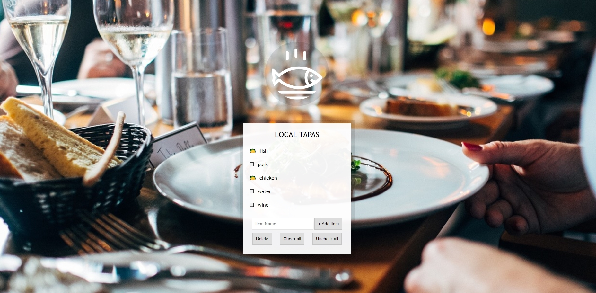

# LocalStorage and Event Delegation



Download or clone repository and click the index.html file to run.

This shows a tapas menu which you can add items to and check the box next to the item to show you want it. Local storage is used to save the data in the browser. 

I added the extra functionality of a button to check all boxes on the menu list, a button to uncheck all boxes on the menu list and a button to delete items from the menu list.

```

### notes

everytime we create an item, it calls `populateList()` and rerendering the entire list again instead of just update one single line, in this case is OK on performance, but practically just update one single line by using React or other frameworks is more efficient and helpful

